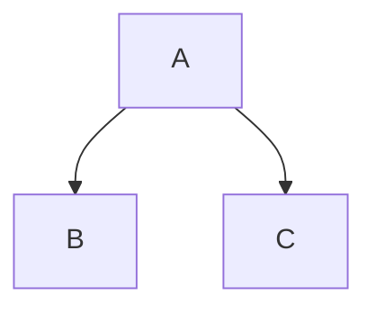
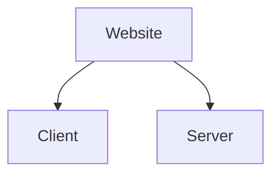

# Daijah Dupree
Github Test Page For Module 5

Github has coding capabilities just like VSC. This is a me learning about markdowns

# Headlines
hashtags/pound signs create headlines and the number of hashtags (1-6) changes the size of the font you want
###### this is the smallest example beacuse the code has 6 hashtags

You can also use (one or multiple) = sign for headline 1 or - sign for headline 2 (which could make your code easier to read). Here's an example:

Daijah Dupree
=
Daijah Dupree
-
Daijah Dupree
=================
Daijah Dupree
-----------------

Other Tips
==========

You can also make words bold by using 2 asterisks on a **word** or 1 asericks on a *word* for italizie. You can use 2 tilde characters ~~to strike through the text~~ of a doc.
>If you want to quote something, use the greater than sign at the begining of the text.

Footnotes
------
This passage is right here to demotrate what footnotes do. You will place your text first followed by the code for the footnote number, and then place the references on the next code line under your text (**note** Github will references will place the references at the bottom of the page).
This is a footnote[^1]. This is another footnote[^2]
[^1]:My reference
[^2]:Another footnote reference

Tables
-----
I cant really explain this so just pay attention to the characters im using and copy this for future coding :) . But if you take a look at the code, you'll notice Github will adjust the format to make everything align approriately. 
| Left | Center | Right |
|------|--------|-------|
| one  | two    | $1.00 |
| four | three  | $2.00 |
| please| try | again beacuse you care |


List
-----
List requires you to start with a charater like astericks or hyphens. Here are some examples,
***
- Item One
- Item Two

---
  1. Item one
  2. Item 2
---
- Item One
- Item Two

Task List
-----
You can also make a task list with checkmarks
- [x] First Task
     - [x] x inside brackets means "checked/done"
     - [x] this list is fully complete
- [ ] This is the Second Task
     - [ ] this is not complete yet
     - [x] this has been complete

 

Links
-----
There are many ways to apply links to your code but for this test I will demostrate one way.
Click [here](https://digitalcrafts.instructure.com/login/canvas) to log into canvas. In the code itself, notice the name of the link is inside reference brackets [ ] and the actual URL is in parathesis ( ). You can also put the link by itself and Github will make it clickable.
https://digitalcrafts.instructure.com/login/canvas

Images
-----
You can also add images to your Github code. Here's the first example, which is almost the same as the links example up above, the only difference is if you add an ! in the beginning.


The next example shows you how to make the image take you to another webpage. Make sure you put reference brackets around the full image code, followed by the parenthesis around the link you want to reference but **BE AWARE** doing it this way **will not** create a new tab for the referenced link: 
[](https://digitalcrafts.instructure.com/login/canvas)

Collapsed Details
-----
<details>
<summary>Click to see what's hiding</summary>
  
# Title
## Subtitle
Hello, reader! Lets say you want to and an **emoji** to your Github code. Type the colon symbol and type the desired emoji but don't put a space between the colon and emoji name. 😄❤️

</details>

Coding in Content
-----
You can use tick marks to highlight `code`. Or you can even make a code block by using 3 tick marks above and below the desired code, which will allow readers to copy you code as well. If you want Github to recognize the code your using, give the refernce abbreveation (js, css, html) after the tick marks at the top:
```html
<!DOCTYPE html>
<html lang="en">
```
```css
.header-wrap {
            background: #E4D7C8;
}
```
```js
let x = 5;
console.log[x];
```
>**FUN FACT** You can also go to the pull request side and cheat the system by typing / and Github will give you a list of common code layouts youll need

### More Tips for Easy to follow Content 
Check out the code preview because I dont feel like explaning ... but you can use them in pull request and issues when working with teams. 

> [!NOTE]
> A note

> [!IMPORTANT]
> This is an important note

> [!WARNING]
> **This is a warning**

This is a blank example for this flow chart

This is a better example for this flow chart



